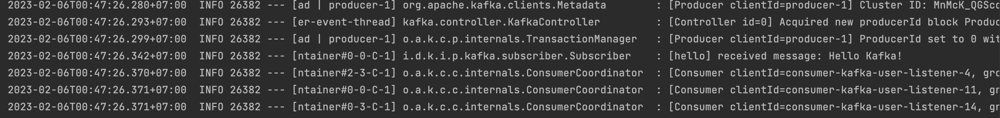
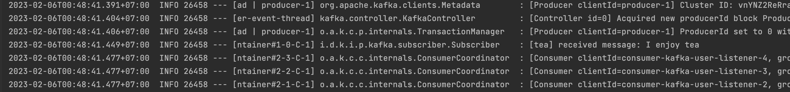
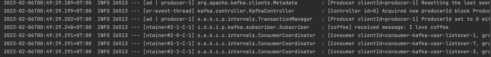
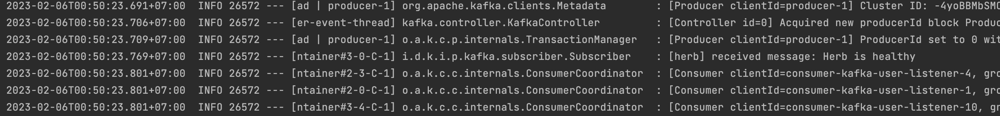
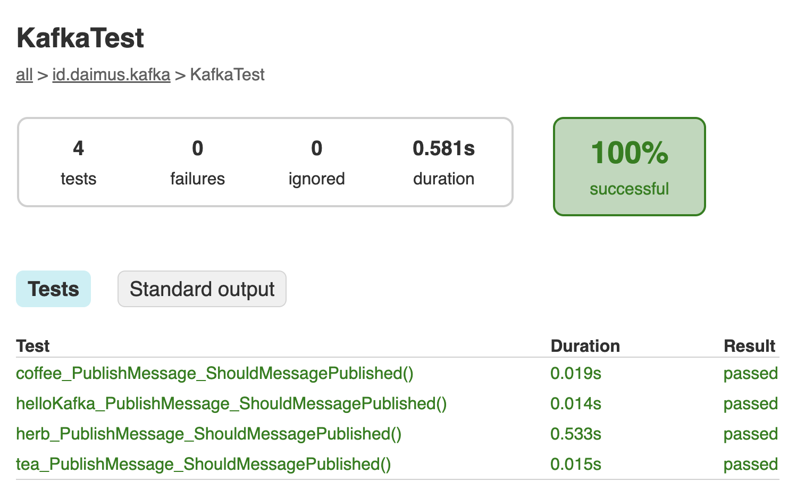

# Day 22 - Kafka

## Problem 1 - Kafka Messaging
Pada aplikasi yang dibuat, dipublishlah pesan "Hello Kafka!" melalui message broker Apache Kafka!. Publish message ditrigger menggunakan unit test, adapun hasil bahwa pesan tersebut telah berhasil diconsume oleh consumer ditunjukan dengan pesan log sbb:

## Problem 2 -  Kafka Topic

Pada aplikasi yang dibuat, ditambah 3 topic yakni tea, coffee, dan herb. Metode pengiriman message kepada message broker sama dengan problem 1, adapun bukti bahwa pesan yang dipublish berhasil diconsume ditunjukan dalam log sbb:

_____

____

Pengujian publish/subscribe ditulis dalam unit test. Adapun hasil pengujian unit test adalah sebagai berikut:
